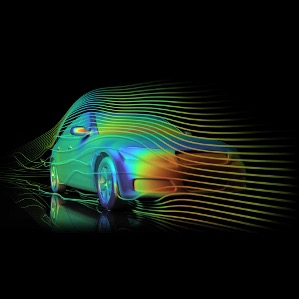
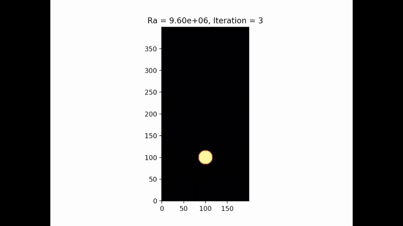
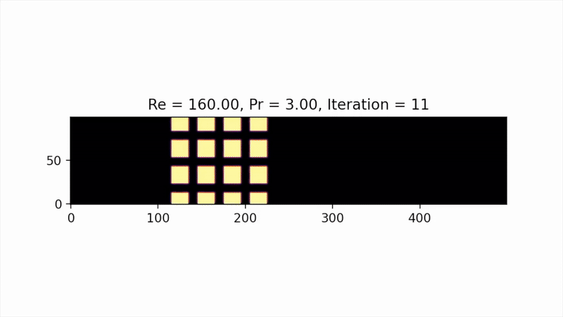

# SCALD
## **S**olving **C**oupled **A**dvanced **L**iquid **D**ynamics

<p align="center">
  
</p>

SCALD is a Python package for solving multiphase fluid dynamics with heat transfer. It leverages the Lattice Boltzmann Method ([LBM](https://en.wikipedia.org/wiki/Lattice_Boltzmann_methods)) using the [BGK](https://en.wikipedia.org/wiki/Bhatnagar%E2%80%93Gross%E2%80%93Krook_operator) approximation, using the [double distribution method](https://doi.org/10.1103/PhysRevE.76.056705) to couple thermal effects with flow. The [Shan-Chen model](https://doi.org/10.1103/PhysRevE.47.1815) is used to capture multiphase interactions. SCALD is designed have minimal dependencies, modular, and parallelized across CPU cores for efficient high-performance simulations.

## Installation
```
pip install -r requirements.txt
```

Dependencies:
- numpy for math routines
- matplotlib for flow field visualization
- numba for parallelization
- tqdm for progress bars

## Quick Start
Once repository is cloned, the fastest way to get a sense of SCALD's capabilities is to run some of the sample scripts. For example, the following runs an airfoil in a wind tunnel simulation:

```
python3 -m examples.airfoil_flow
```

## Examples
Lid driven cavity flow
<p align="center">
  
</p>

Flow past cylinders
<p align="center">
  
</p>

Rayleigh-Bernard convection
<p align="center">
  
</p>

Thermal bubble rising
<p align="center">
  
</p>

Forced convection past boxes
<p align="center">
  
</p>

Droplet collision
<p align="center">
  
</p>

## Benchmarks
In progress, please feel free to contribute to this if have different architecture.

## File Structure
```
├── LICENSE
├── README.md
├── requirements.txt
├── .gitignore
├── assets
│   ├── cylinder_flow.gif         # Flow past cylinders 
│   ├── droplet.gif               # Droplet collision 
│   ├── ldc_flow.gif              # Lid driven cavity flow 
│   ├── rbc.gif                   # Rayleigh-Bernard convection 
│   ├── scald.jpg                 # scald package picture
│   ├── thermal_box_flow.gif      # Forced convection past boxes 
│   ├── thermal_bubble.gif        # Thermal bubble rising 
├── examples
│   ├── airfoil_flow.py           # Flow past airfoil
│   ├── box_flow.py               # Flow past boxes
│   ├── box_thermal_flow.py       # Forced convection past boxes
│   ├── cylinder_flow.py          # Flow past cylinders     
│   ├── cylinder_thermal_flow.py  # Forced convection past cylinders             
│   ├── droplet.py                # Droplet collision
│   ├── ldc_flow.py               # Lid driven cavity flow
│   ├── rayleigh_bernard.py       # Rayleigh-Bernard convection
│   ├── rising_smoke.py           # Smoke source natural convection
│   ├── thermal_bubble.py         # Thermal bubble natural convection
├── src
│   ├── boundaries.py             # Handles robust boundary conditions
│   ├── constants.py              # LBM BGK D2Q9 grid constants
│   ├── init.py                   # Initialize distributions used in examples
│   ├── kernels.py                # Parallelized LBM solving kernels
```

## Contributing
Work is not finished for `SCALD`. Contributions are welcomed and appreciated! Fork and create a pull request on [GitHub](). We value the input and experiences all users and contributors bring. 

Tentative to do list:
- Time profiling and shell script for going through all examples
- Improve code modularization and performance
- Implement Multiple Relaxation Time ([MRT](https://link.springer.com/chapter/10.1007/978-3-319-44649-3_10)) collision operators to model higher Re flows
- Add more code documentation

## Acknowledgements

Much of the code in this repository comes from the help of the following resources:
1. A Practical Introduction to the Lattice Boltzmann Method, Alexander J. Wagner (https://www.ndsu.edu/sites/default/files/fileadmin/physics.ndsu.edu/Wagner/LBbook.pdf)
2. The Lattice Boltzmann Method Principles and Practice, Krüger et. al (https://link.springer.com/book/10.1007/978-3-319-44649-3)
3. Lattice-Boltzmann Fluid Dynamics, Schroeder (https://physics.weber.edu/schroeder/javacourse/LatticeBoltzmann.pdf)
4. EGEE 520: Mathematical Modeling Lattice-Boltzmann Method, Alzaabi et al (https://personal.ems.psu.edu/~fkd/courses/EGEE520/2019Deliverables/lbm.pdf)
